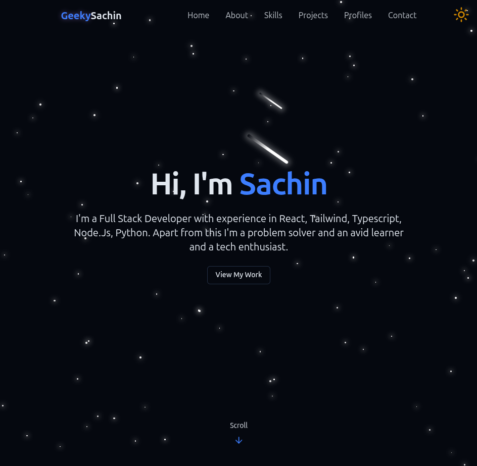

# 🚀 Personal Portfolio Website

A modern, responsive **portfolio website** built with **React**, **TypeScript**, and **Tailwind CSS** to showcase my projects, skills, and experience. The site focuses on clean UI, performance, and accessibility.

---

## ✨ Features

- ⚛️ Built with **React + TypeScript**
- 🎨 Styled using **Tailwind CSS**
- 📱 Fully **responsive** design
- ⚡ Fast build & dev environment using **Vite**
- 🧩 Reusable and well-structured components
- 🌙 Clean, minimal, and modern UI
- 🔍 SEO-friendly metadata

---

## 🛠️ Tech Stack

- **Frontend:** React, TypeScript
- **Styling:** Tailwind CSS
- **Build Tool:** Vite
- **Linting:** ESLint
- **Deployment:** GitHub Pages / Vercel / Netlify (optional)

---

## 📂 Project Structure

```bash
src/
├── assets/        # Images, icons, logos
├── components/    # Reusable UI components
├── pages/         # Page-level components
├── styles/        # Global styles (if any)
├── App.tsx        # Root component
├── main.tsx       # Entry point
```

---

## 🚀 Getting Started

### Prerequisites

Make sure you have the following installed:

- **Node.js** (v18 or later recommended)
- **npm** or **yarn**

### Installation

```bash
# Clone the repository
git clone https://github.com/your-username/your-portfolio.git

# Navigate to the project folder
cd your-portfolio

# Install dependencies
npm install
```

### Run Locally

```bash
npm run dev
```

The app will start on:

```
http://localhost:5173
```

---

## 📦 Build for Production

```bash
npm run build
```

Preview the production build:

```bash
npm run preview
```

---

## 🌐 Deployment

You can deploy this project on platforms like:

- **Vercel**
- **Netlify**
- **GitHub Pages**

Make sure to update the base path in `vite.config.ts` if deploying to GitHub Pages.

---

## 🔐 Environment Variables

If your project uses environment variables, create a `.env` file:

```env
VITE_PUBLIC_KEY=your_value_here
```

> ⚠️ Do not commit `.env` files to GitHub.

---

## 📸 Screenshots



---

## 📌 Roadmap

- [ ] Add dark mode
- [ ] Improve animations
- [ ] Add blog section
- [ ] Enhance accessibility

---

## 📄 License

This project is open source and available under the **MIT License**.

---

## 👤 Author

**Sachin**

- Portfolio: _Coming soon_
- GitHub: [https://github.com/your-username](https://github.com/your-username)
- LinkedIn: [https://linkedin.com/in/your-profile](https://linkedin.com/in/your-profile)

---

⭐ If you like this project, consider giving it a star!
